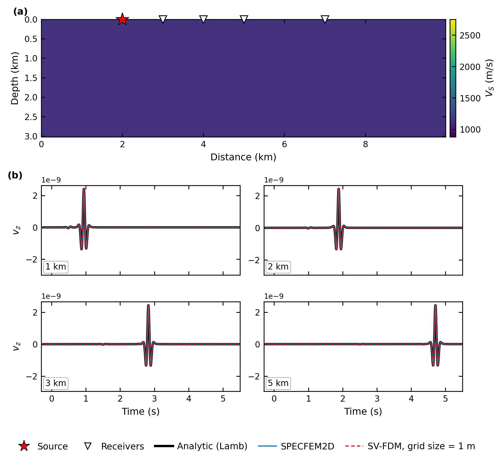
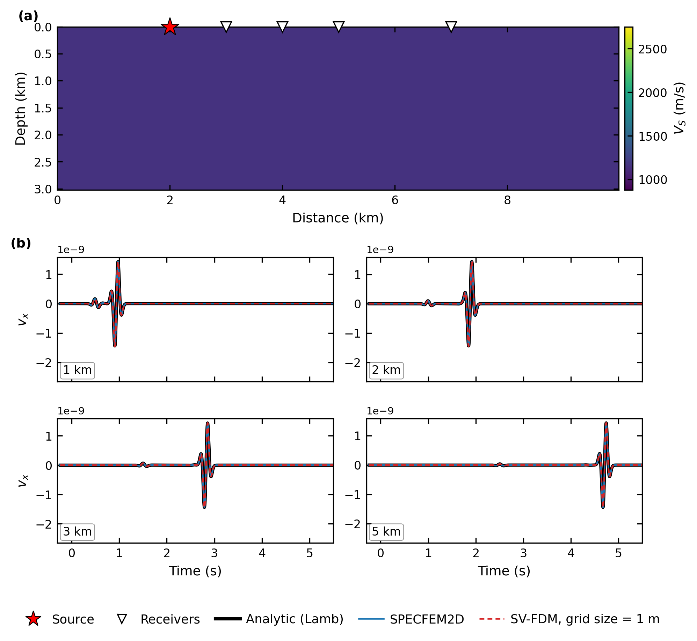
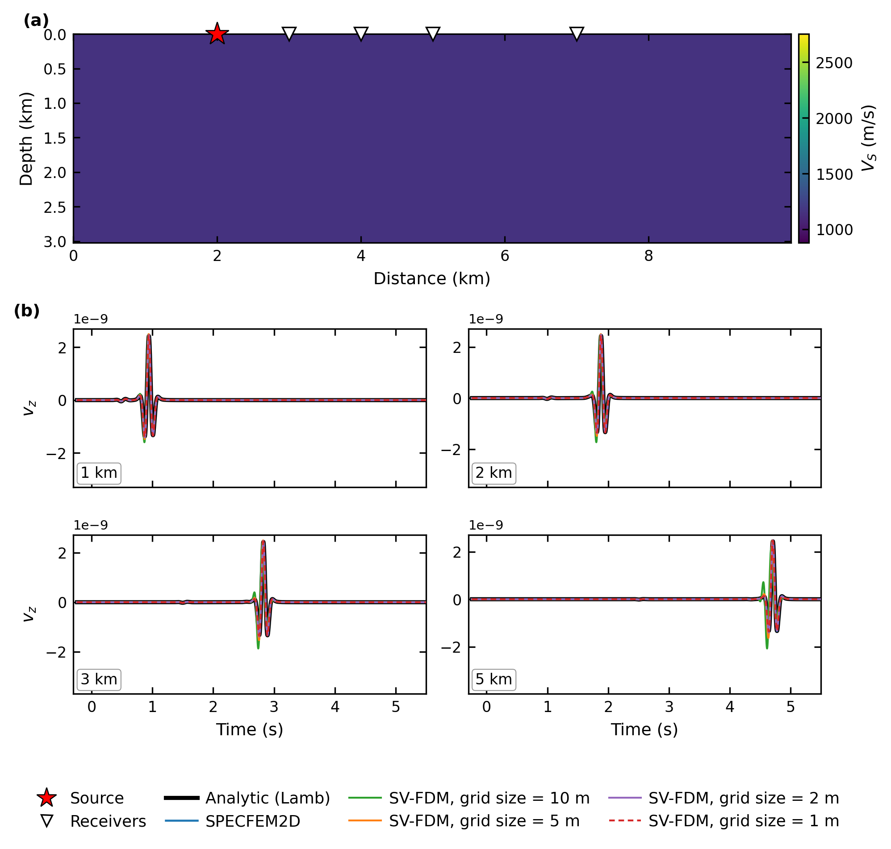
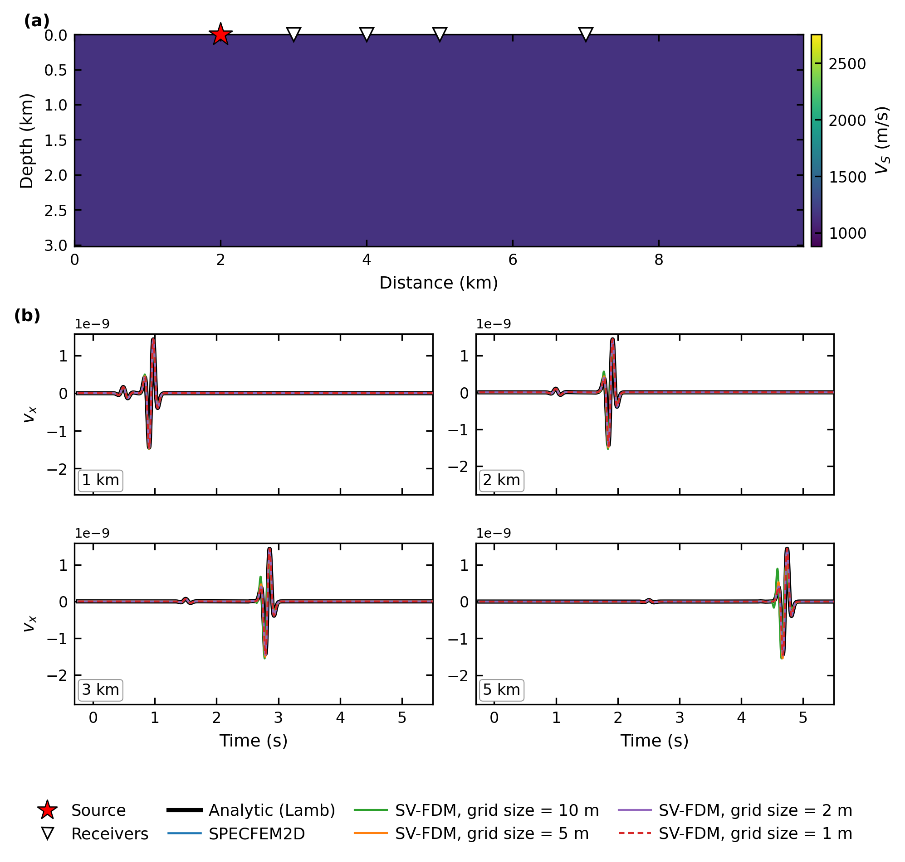
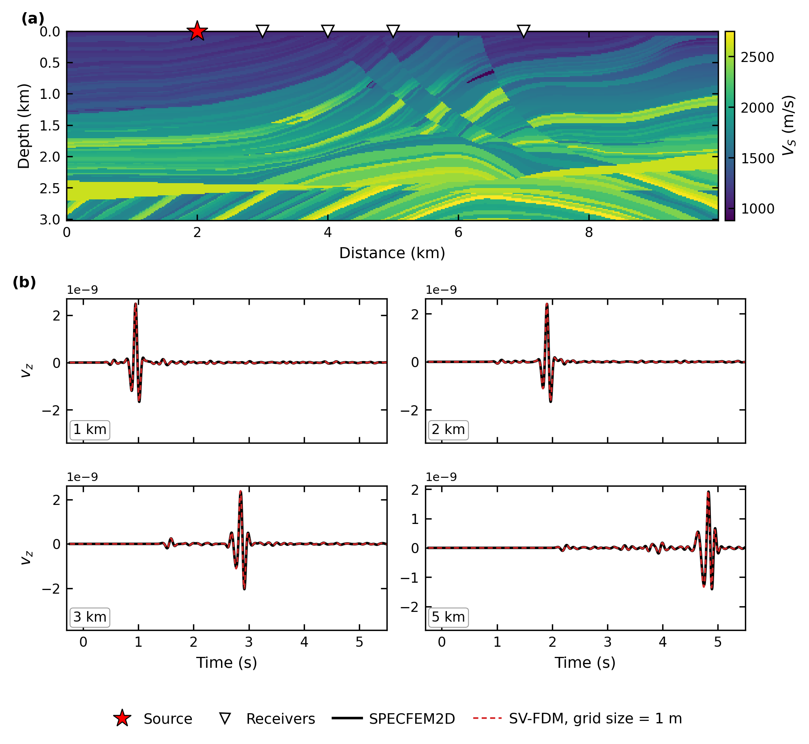
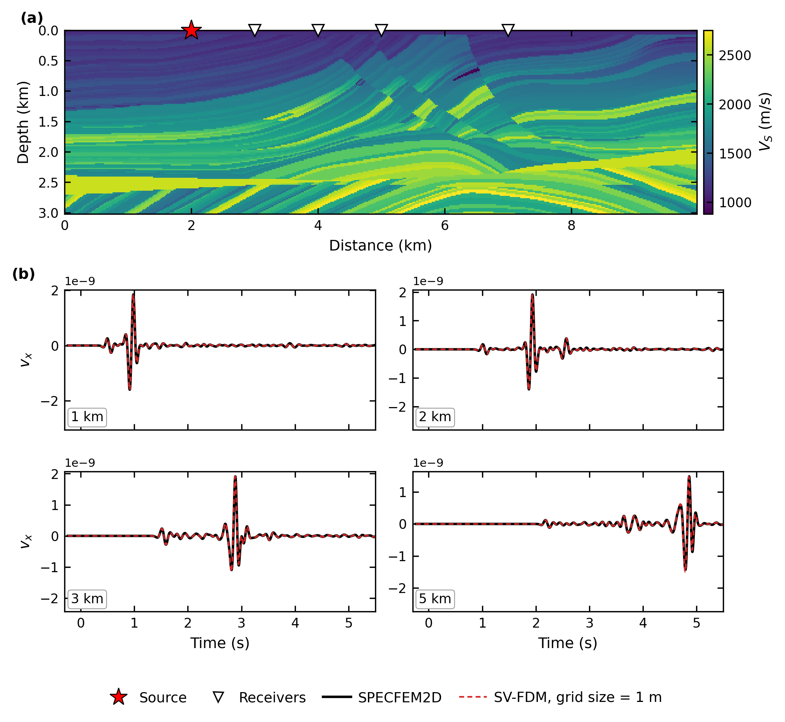
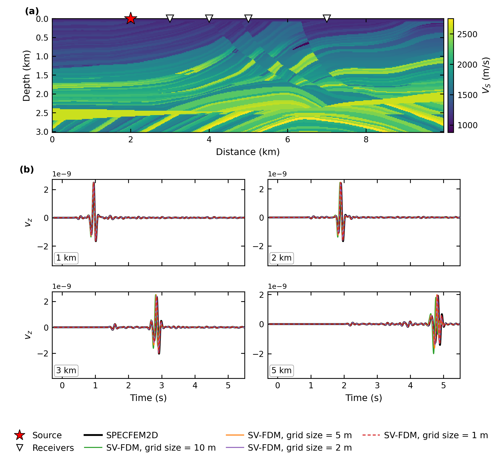
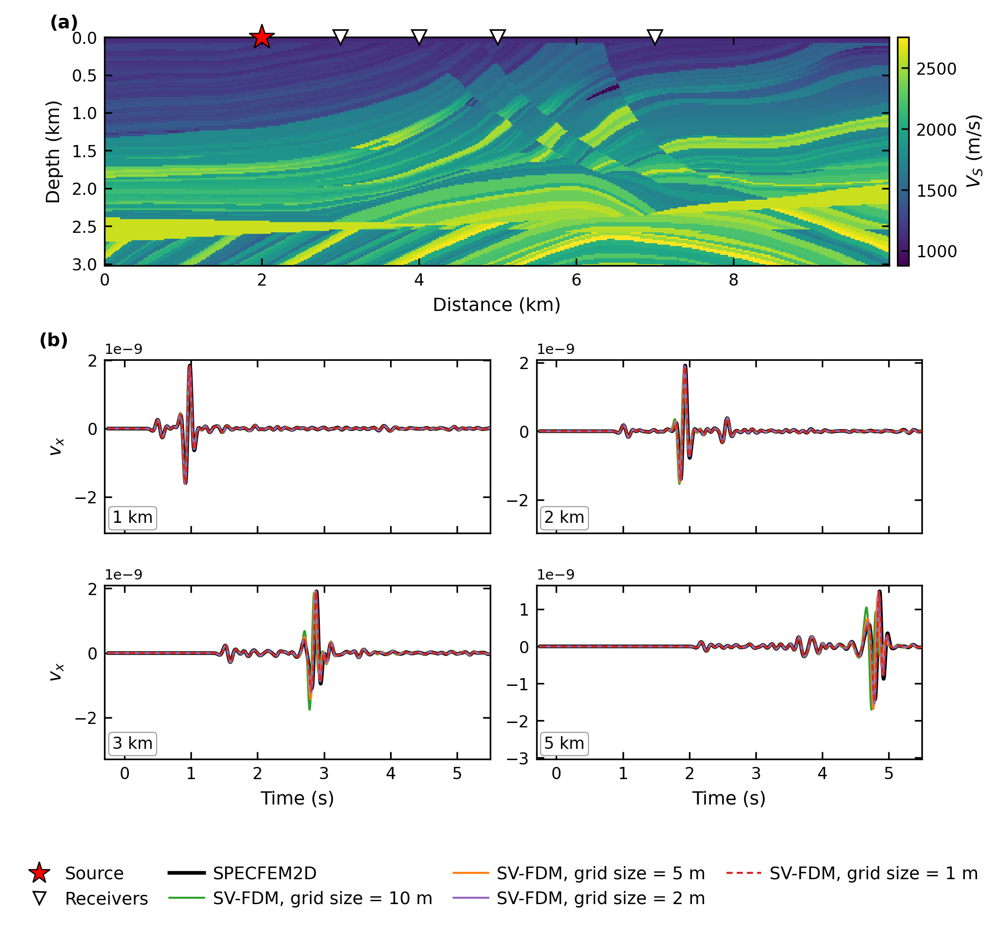

# Strain-velocity FDM

A 2D P-SV elastic forward solver written in **JAX**, using the
**velocity-strain** formulation on a staggered grid (2nd/4th/8th-order
stencils, C-PML absorbing boundaries, free surface).

Because the solver is written in JAX, it is a **differentiable program**: the
recorded wavefields can be differentiated with respect to `Vp`, `Vs` and
`rho` with `jax.grad`, without deriving or coding an adjoint solver. The
same code is JIT-compiled for the GPU and can be batched over shots with
`jax.vmap`, which makes it directly usable for full-waveform inversion.

## Why velocity-strain?

Distributed acoustic sensing (DAS) measures strain, not particle velocity
or stress. Here, strain is a primary wavefield variable, so DAS-type
records (`exx`, `ezz`, with optional gauge-length averaging) come straight
out of the time loop, together with `vx` and `vz`.

## Usage

Requirements: `jax` (a CUDA build for GPU) and `numpy`. The validation
scripts also need `scipy` and `matplotlib`.

```python
import numpy as np
import jax
import jax.numpy as jnp
from forward import build_forward_fn, ricker_jax

# Model: (nz, nx) arrays in m/s and kg/m^3, row 0 at the surface
vp = np.load('marmousi_models/vp_true.npy')
vs = np.load('marmousi_models/vs_true.npy')
rho = np.load('marmousi_models/rho_true.npy')
nz, nx = vs.shape
dx = 20.0                                   # grid spacing (m)

fc, nt = 3.0, 3000                          # Ricker peak frequency (Hz), time steps
dt = 0.5 * dx / (vp.max() * np.sqrt(2))   # stable time step (s)
pad = 20                                    # PML thickness (grid points)

rec_x = np.arange(nx)                       # receivers: one per column,
rec_z = np.zeros(nx, dtype=int)             # on the free surface

run_shot = build_forward_fn(nz, nx, dx, dx, dt, nt, fc, pad, 250,
                            rec_x, rec_z, fd_order=8, free_surface=True)
wavelet = ricker_jax(jnp.arange(nt) * dt, fc, 1.5 / fc)

# Source at grid indices (ix, iz) = (100, 0)
vx, vz, exx, ezz = run_shot(vs, vp, rho, 100, 0, wavelet)

# Gradient of a misfit with respect to Vs
loss = lambda vs: jnp.sum(run_shot(vs, vp, rho, 100, 0, wavelet)[1] ** 2)
grad_vs = jax.grad(loss)(jnp.asarray(vs))
```

**`build_forward_fn(nz, nx, dx, dz, dt, nt, freq, pad, block_size, rec_x, rec_z, ...)`**
returns a JIT-compiled `run_shot(vs, vp, rho, src_x, src_z, wavelet)`.

| Input | Description |
| --- | --- |
| `nz, nx` | Model size (grid points) |
| `dx, dz, dt` | Grid spacing (m) and time step (s); `dt` must satisfy the CFL condition |
| `nt` | Number of time steps |
| `freq` | Source peak frequency (Hz), used to tune the PML |
| `pad` | PML thickness (grid points), added outside the model on the sides and bottom |
| `block_size` | Time steps per checkpoint block (trades memory for recomputation in `jax.grad`) |
| `rec_x, rec_z` | Receiver grid indices |
| `fd_order` | Spatial order: 2, 4 or 8 |
| `free_surface` | `True`: free surface on top. `False`: PML on all four sides |
| `gauge_length`, `component` | Optional DAS gauge-length averaging (m), applied to one component |
| `vs, vp, rho` | Model arrays, `(nz, nx)` |
| `src_x, src_z` | Source grid indices (vertical point force) |
| `wavelet` | Source time function, `(nt,)`, e.g. from `ricker_jax(t, fc, t0)` |

**Output:** a tuple `(vx, vz, exx, ezz)`, each of shape `(nt, n_receivers)`.
These are the particle velocities (m/s) and normal strains at the receivers.

## Validation

Both test cases use the same acquisition geometry: a 10 km × 3 km domain
with a free surface on top, a vertical point force (5 Hz Ricker wavelet) at
x = 2 km on the surface, and receivers along the surface. The traces are
shown at offsets of 1, 2, 3 and 5 km. No amplitude scaling is applied to
any of the traces.

| Case | Model | References | SV-FDM grid size |
| --- | --- | --- | --- |
| 1 | Homogeneous half-space (Vp 2000 m/s, Vs 1155 m/s, ρ 2000 kg/m³) | Analytic Lamb solution, SPECFEM2D | 1 m |
| 2 | Homogeneous half-space, grid convergence | Analytic Lamb solution, SPECFEM2D | 10, 5, 2 and 1 m |
| 3 | Marmousi2 | SPECFEM2D | 1 m |
| 4 | Marmousi2, grid convergence | SPECFEM2D | 10, 5, 2 and 1 m |

SPECFEM2D uses 20 m spectral elements with 4th-order GLL points. SV-FDM
uses 8th-order spatial stencils.

### Case 1: homogeneous half-space

| v<sub>z</sub> | v<sub>x</sub> |
| --- | --- |
|  |  |

### Case 2: grid convergence on the half-space

| v<sub>z</sub> | v<sub>x</sub> |
| --- | --- |
|  |  |

### Case 3: Marmousi

| v<sub>z</sub> | v<sub>x</sub> |
| --- | --- |
|  |  |

### Case 4: grid convergence on Marmousi

| v<sub>z</sub> | v<sub>x</sub> |
| --- | --- |
|  |  |

### Limitations

* **Surface waves need a fine grid.** Although the interior stencils are
  8th order, the Rayleigh wave converges at a much lower rate. At 5 Hz, a
  1 m grid is needed for close agreement. At 5 m and 10 m, the surface
  wave shows clear numerical dispersion: it arrives early, and the error
  grows with offset (Cases 2 and 4).
* **Marmousi does not match SPECFEM2D as closely as the half-space
  does.** Even at 1 m, the SV-FDM and SPECFEM2D traces drift apart in
  phase and amplitude as the offset grows, with the largest difference on
  the surface wave at 5 km. On the homogeneous half-space, both codes agree
  with the analytic solution, so the remaining difference is most likely
  due to how each code samples the heterogeneous model. SPECFEM2D
  interpolates it onto GLL points, while SV-FDM interpolates it
  bilinearly onto the finite-difference grid. This has not been
  isolated yet.
* Only a vertical point force is implemented.

### Reproducing

The SPECFEM2D gathers are stored in `validation/reference/`, so the
comparisons run without a SPECFEM2D installation. A GPU is needed for the
1 m runs. The FD results are cached in `validation/results/`.

```bash
cd validation
python compare_homogeneous.py     # Cases 1 and 2
python compare_marmousi.py        # Cases 3 and 4
```

The SPECFEM2D inputs for the Marmousi run are in
`validation/specfem_example/`, together with instructions for running it.

## Third-party code and data

* **Analytic Lamb solution:**
  [lamb_2dhalf_surface](https://github.com/ktkimit/lamb_2dhalf_surface)
  by Ki-Tae Kim, licensed under LGPL-3.0. It is not redistributed here:
  `compare_homogeneous.py` downloads it into `validation/external/` on
  first use. The only change is that the demonstration block at the end
  of the file is removed, so that it can be imported.
* **Reference seismograms:** computed with
  [SPECFEM2D](https://github.com/SPECFEM/specfem2d) (GPL-3.0). Only its
  output seismograms and input files are included in this repository.
* **Marmousi models:** derived from Marmousi2 (Martin, Wiley & Marfurt,
  2006, *The Leading Edge* 25(2), 156–166).

## License

MIT. See [LICENSE](LICENSE). The third-party components above are under
their own licenses.
