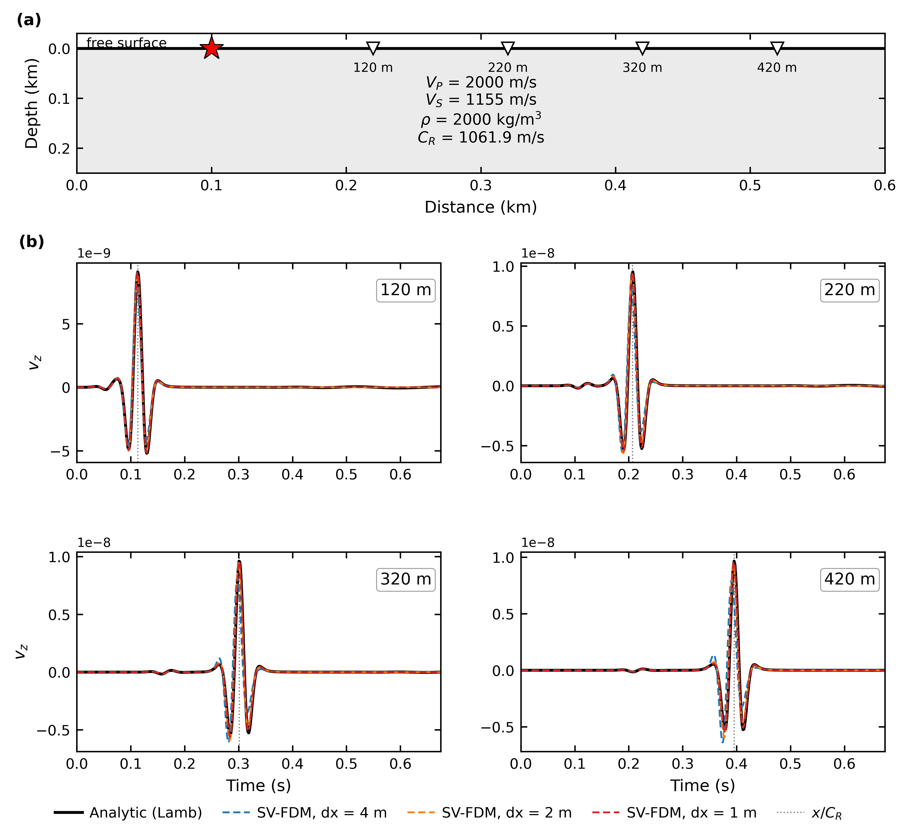
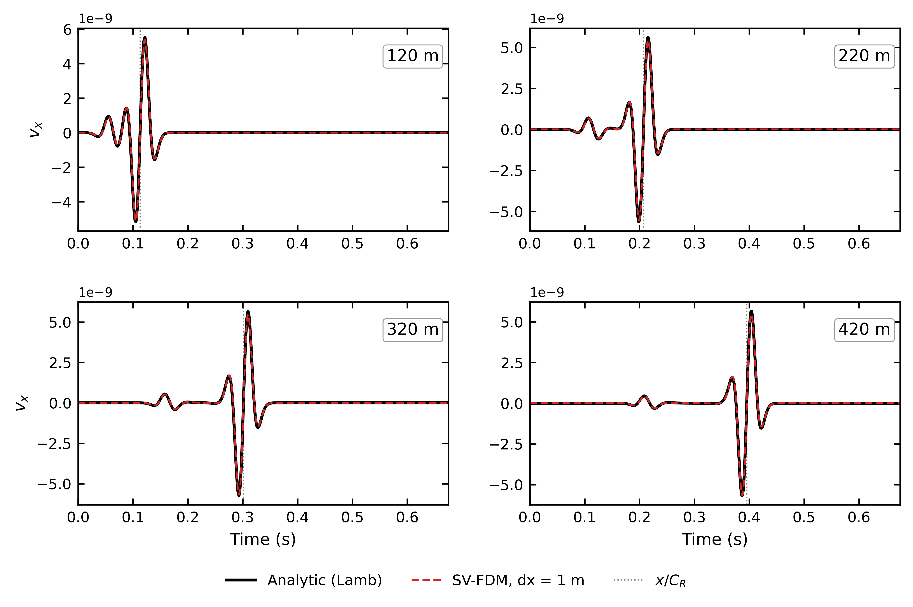
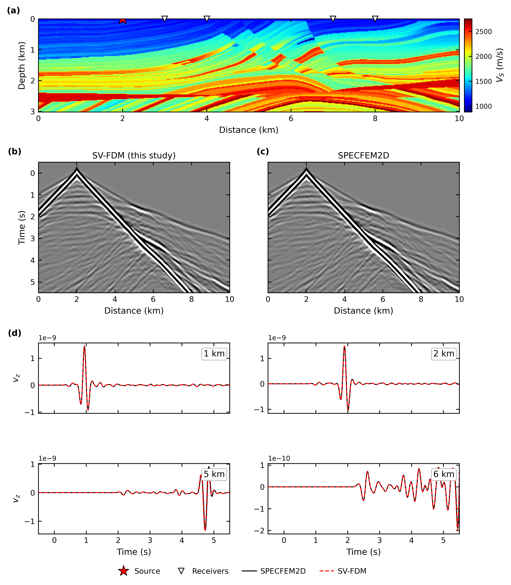

# Strain-velocity FDM

Differentiable 2D P-SV elastic forward solver in JAX, written in the
**velocity-strain** formulation on a staggered grid (2nd/4th/8th order, C-PML,
free surface). Jitted, `vmap`-able over shots, and differentiable with respect
to `Vp`, `Vs` and `rho` through `jax.grad`.

## Why strain-velocity instead of stress-velocity?

Distributed acoustic sensing (DAS) measures strain, not particle velocity or
stress. A stress-velocity code has to recover strain afterwards, by inverting
the stress through the elastic moduli or by differentiating the recorded
velocities. Here strain is a primary wavefield variable, so DAS-type
recordings (`exx`, `ezz`, with optional gauge-length averaging) come straight
out of the time loop, alongside `vx` and `vz`.

## Validation

**Analytic Lamb solution** (homogeneous half-space, vertical force at the
free surface) — vertical and horizontal velocity:

**SPECFEM2D on Marmousi with free surface** (`dx = 1 m`, `fc = 3 Hz`, 8th order):

Reproduce with `python validation/compare_analytic.py`,
`python validation/compare_analytic_vx.py` and
`DX=1 CASE=fs python validation/compare_vz.py`.

## Third-party code

The analytic Lamb solution is computed by
[lamb_2dhalf_surface](https://github.com/ktkimit/lamb_2dhalf_surface)
(Ki-Tae Kim, LGPL-3.0). It is not redistributed here; `compare_analytic.py`
downloads it into `validation/external/` on first run.

Marmousi models are derived from Marmousi2
(Martin, Wiley & Marfurt, 2006, *The Leading Edge* 25(2), 156-166).
