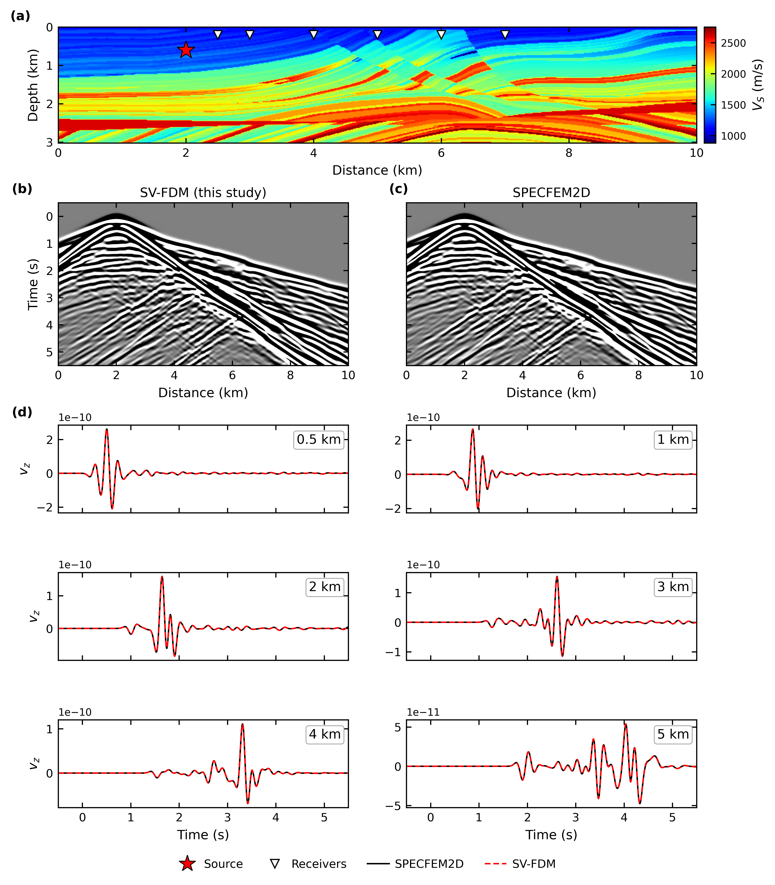

# Strain-velocity FDM

Forward modelling of 2D P-SV elastic waves in JAX, written in the
**velocity-strain** formulation on a staggered grid.

The solver is a single JAX function: jitted, vectorisable over shots with
`vmap`, and differentiable with respect to `Vp`, `Vs` and `rho` through
`jax.grad`. Gradients come from reverse-mode automatic differentiation of the
time loop itself, so there is no separate adjoint solver to write or keep in
sync with the forward one. Block checkpointing keeps the memory cost of that
reverse pass bounded.

Features:

- 2nd, 4th and 8th order spatial accuracy
- C-PML absorbing boundaries with a stretching factor (`kappa`), which handles
  grazing incidence better than the `kappa = 1` variant
- Free surface, or PML on all four sides
- Records particle velocity (`vx`, `vz`) and strain (`exx`, `ezz`)
- Optional DAS gauge-length averaging for strain recordings

## Install

The solver is a single file, `forward.py`. Copy it next to your script, or add
this directory to `sys.path`.

```bash
pip install "jax[cuda12]" numpy scipy matplotlib   # or plain jax for CPU
```

## Use

```python
import numpy as np, jax.numpy as jnp
from forward import build_forward_fn, ricker_jax

nz, nx, dx, dt, nt, fc = 152, 500, 20.0, 2e-3, 3000, 6.0
vs  = np.full((nz, nx), 1500.0)
vp  = np.full((nz, nx), 2600.0)
rho = np.full((nz, nx), 2000.0)

run_shot = build_forward_fn(
    nz, nx, dx, dx, dt, nt, fc,
    pad=80,                       # PML width in grid points
    block_size=250,               # checkpoint block length
    rec_x=np.arange(nx), rec_z=np.zeros(nx, dtype=int),
    fd_order=8, free_surface=True)

wavelet = ricker_jax(jnp.arange(nt) * dt, fc, 1.5 / fc)
vx, vz, exx, ezz = run_shot(jnp.array(vs), jnp.array(vp), jnp.array(rho),
                            jnp.int32(nx // 2), jnp.int32(0), wavelet)
```

Differentiating through it:

```python
import jax

def misfit(vs_model):
    _, vz, _, _ = run_shot(vs_model, jnp.array(vp), jnp.array(rho),
                           jnp.int32(nx // 2), jnp.int32(0), wavelet)
    return jnp.sum((vz - observed) ** 2)

grad = jax.grad(misfit)(jnp.array(vs))     # same shape as the model
```

Shots run in parallel with `jax.vmap(run_shot, in_axes=(None, None, None, 0, 0, None))`.

## Validation

Two independent checks, both reproducible from this repository.

**Against SPECFEM2D on Marmousi.** Stored SPECFEM2D seismograms ship in
`validation/reference/`, so the comparison runs without a SPECFEM2D build:

```bash
python validation/compare_vz.py              # body waves,  dx = 5 m
CASE=fs python validation/compare_vz.py      # surface waves
```

Vertical velocity, `fc = 3 Hz`, 8th order, `dx = 5 m`, over all 500 receivers:

| configuration | rel. RMS | correlation | amplitude ratio |
| --- | --- | --- | --- |
| body waves (PML on all sides, source 600 m deep) | 0.024 | 0.9997 | 1.003 |
| surface waves (free surface, source at the surface) | 0.398 | 0.921 | 0.896 |



To regenerate the reference instead of using the stored one, you need a
SPECFEM2D installation:

```bash
python validation/build_specfem_case.py    # writes DATA/
./validation/run_this_example.sh
SPEC_OUT=OUTPUT_FILES SPEC_LOG=solver.log SPEC_PAR=DATA/Par_file \
    python validation/compare_vz.py
```

**Against the analytic Lamb solution.** A vertical line force on a homogeneous
half-space has a closed-form response, so this needs no reference solver at
all:

```bash
python validation/compare_analytic.py
```

Correlation with the analytic trace depends only on how many grid points
sample the shortest wavelength — the same curve for `fc = 6 Hz` and
`fc = 20 Hz`, whose absolute scales differ by more than a factor of three:

| points per wavelength | nearest offset | farthest offset |
| --- | --- | --- |
| 3.5 | 0.781 | 0.006 |
| 7.1 | 0.948 | 0.653 |
| 14.2 | 0.989 | 0.918 |
| 21.2 | 0.998 | 0.979 |

Surface waves are the limiting case. They travel in the slowest layer, so at a
given spacing they are sampled about twice as coarsely as body waves, and they
do not spread geometrically, so they dominate the record at long offsets.
Refining the grid is the effective remedy; raising the FD order is not, since
4th and 8th order already agree with each other.

## Third-party code

The analytic Lamb solution is computed by
[lamb_2dhalf_surface](https://github.com/ktkimit/lamb_2dhalf_surface)
(Ki-Tae Kim, LGPL-3.0). It is not redistributed here — that licence would
otherwise apply to this repository — so `compare_analytic.py` downloads it
into `validation/external/` on first run and uses it unmodified, apart from
dropping the demonstration block at the end of the file so it can be imported.

## Reference

Marmousi models under `marmousi_models/` are derived from Marmousi2
(Martin, Wiley & Marfurt, 2006, *The Leading Edge* 25(2), 156-166).
